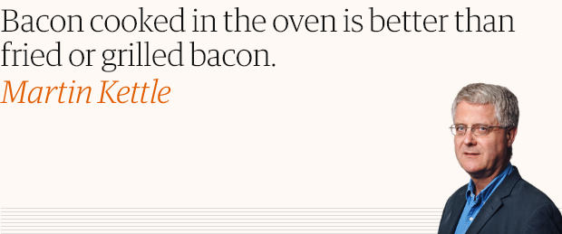

###Fake news opinion column

Scrapes tweets from [@anon_opin](https://twitter.com/anon_opin) and presents them as opinion columns from [The Guardian](https://www.theguardian.com/commentisfree/2020/apr/25/contact-apps-wont-end-lockdown-but-they-might-kill-off-democracy).

###Prerequisites

- [Python 3](https://www.python.org/ftp/python/3.8.2/python-3.8.2.exe) (I used 3.8)
- [Tweepy](http://docs.tweepy.org/en/latest/install.html) + API keys
- [Requests](https://requests.readthedocs.io/en/master/user/install/)
- [Beautiful soup](https://www.crummy.com/software/BeautifulSoup/bs4/doc/#installing-beautiful-soup)
- [Selenium ChromeDriver](https://chromedriver.chromium.org/home)

### Usage

- Install dependencies
- Add API keys to ``keys_blank.py`` and rename it to ``keys.py``
- Run ``main.py`` from a terminal
- The script will scrape tweets and then dump 30 png images in a "bad-opinions" directory inside the current working directory

Tested in Windows 10 only.

**Disclaimer:** The files output by this do not reflect the opinions of the names presented.

###Acknowledgements

 - [B3ta](http://b3ta.com/) for the [idea](https://www.facebook.com/b3tan/posts/3281475811865011)